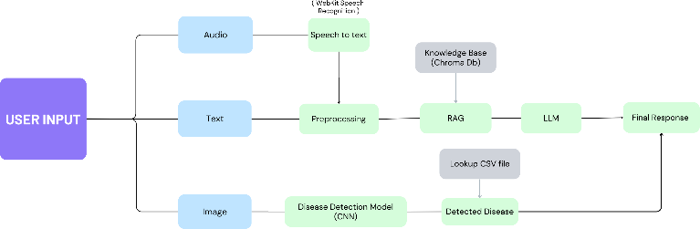
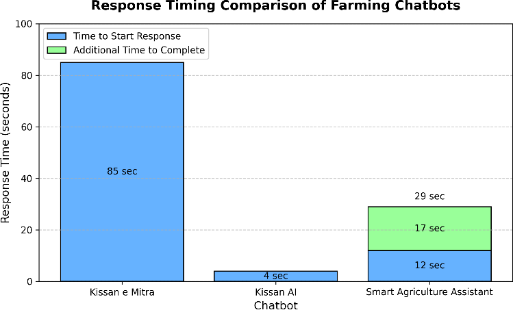
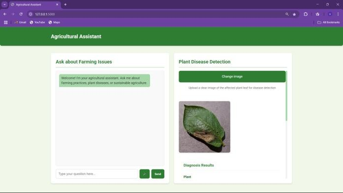

# 🌱 Smart Agriculture Assistant

An AI-powered farm assistance platform that combines **text-based agricultural consultancy**, **voice interaction**, and **image-based plant disease detection** into a single, locally-deployable system — built to give farmers real-time, accurate, and accessible crop care advice without relying on costly cloud APIs.



## 🚀 Why this exists

Most farmer-facing AI tools specialize in one thing — either a chatbot *or* disease detection *or* voice support — but not all three together. Cloud-based assistants like Kissan AI also rely on outdated LLM snapshots and recurring API costs, which makes them expensive and slow for rural deployment.

This project takes a different approach:
- Runs **Llama 3.2 (3B)** locally via Ollama — no API costs, no data leaving the device
- Combines **Retrieval-Augmented Generation (RAG)** with a **Chroma vector database** for accurate, source-grounded farming advice
- Uses a custom-trained **CNN** for plant disease detection across **39 disease classes**, trained on **61,486 images** (PlantVillage dataset)
- Supports **speech-to-text** interaction for low-literacy users

## 📊 Results

| Metric | Result |
|---|---|
| Disease detection accuracy (CNN, 39 classes) | **92%** |
| LSA summarization (ROUGE-1) | 0.2292 |
| Keyword extraction (SpaCy, F1) | 0.0978 |
| Response initiation time | ~12 sec |

**Response time vs. existing farming chatbots:**



While commercial systems like Kissan e Mitra lag at 85 seconds to even begin a response, this system starts responding in ~12 seconds — fully on-device, with no internet dependency for disease diagnosis.

## 🖥️ How it looks



The interface offers two panels: a conversational chatbot for farming questions (left) and an image upload tool for instant disease diagnosis (right).

## 🏗️ Architecture

- **Text/Voice query** → preprocessed (SpaCy NLP) → retrieved from Chroma vector DB → passed to **Llama 3.2** for response generation
- **Image query** → CNN model → disease class + confidence → matched against a disease info lookup (CSV) → returns description + treatment steps
- Document ingestion pipeline: PDFs → sentence-aware chunking (SpaCy) → LSA-based summarization → embeddings (Ollama `nomic-embed-text`) → stored in Chroma

## 🛠️ Tech Stack

`Python` · `PyTorch` (CNN) · `Flask` · `LangChain` · `Chroma` (vector DB) · `Ollama` (Llama 3.2, nomic-embed-text) · `SpaCy` (NLP) · `Sumy` (LSA summarization) · `SpeechRecognition`

## 📦 Setup

```bash
# Clone the repo
git clone https://github.com/pankajrana19/<repo-name>.git
cd <repo-name>

# Install dependencies
pip install -r requirements.txt

# Pull required Ollama models
ollama pull llama3.2
ollama pull nomic-embed-text

# Download trained model weights (CNN, ~88MB)
# Place full_model.pt in the project root:
# Download from: (https://drive.google.com/file/d/1_PXao2QVo344e3Iy32SQFzRNfulmfoZR/view?usp=sharing)

# Run the app
python app.py
```

Then open `http://127.0.0.1:5000` in your browser.

## 📁 Project Structure

```
├── app.py                  # Flask app — routes for chat + disease detection
├── CNN.py                  # CNN model architecture
├── data_creation.py        # PDF ingestion → chunking → Chroma vector store
├── appending_data.py        # Append new docs to existing Chroma DB
├── chat.py                 # CLI-based chatbot testing script
├── disease_info.csv        # Disease descriptions + treatment steps
├── Plant_Disease_Detection_Code.ipynb  # CNN training notebook
└── disease.ipynb           # TensorFlow-based training experiments
```

## 🔮 Future Improvements

- Multilingual support for regional languages
- Mobile app for offline use in low-connectivity areas
- IoT integration (soil sensors, weather stations) for real-time environmental data
- Reducing response completion latency

## 📚 Background

This project began as a final-year capstone exploring whether locally-deployable LLMs (Llama 3.2 3B) could match or beat cloud-based agricultural assistants (e.g., GPT-3.5-based Kissan AI) on accuracy, cost, and response time — while keeping farmer data fully on-device.

---

*Built by [Pankaj Rana](https://github.com/pankajrana19)*
